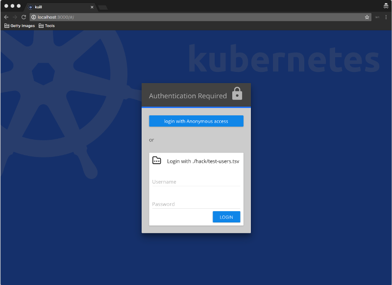
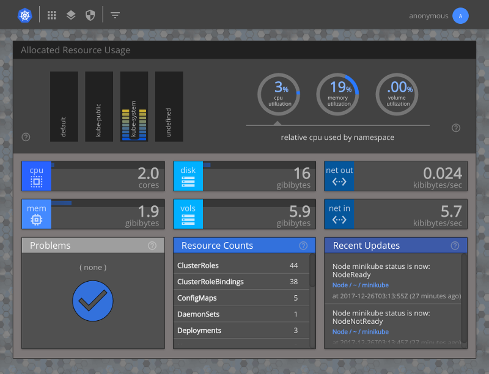
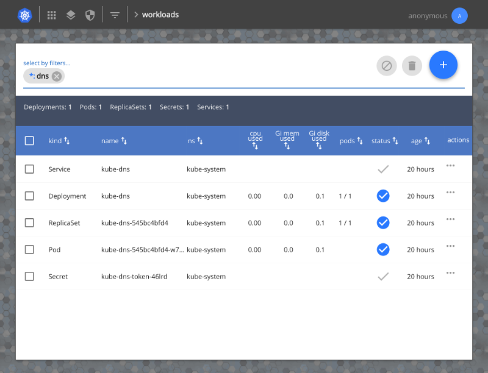
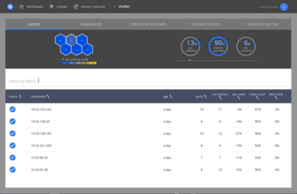
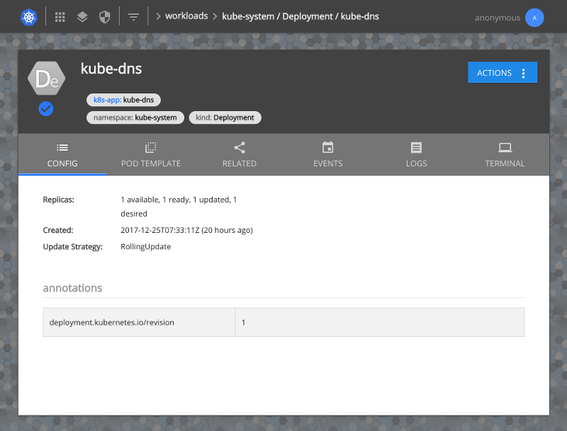
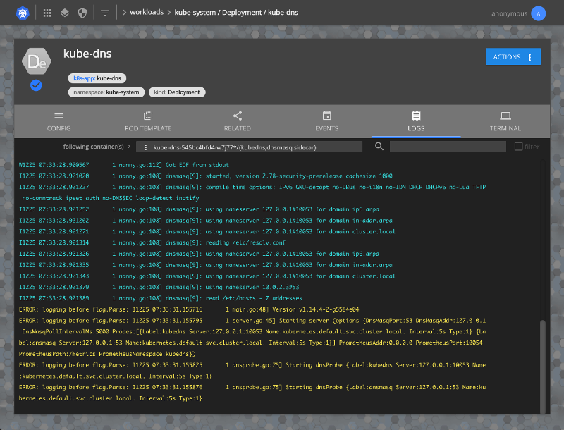

 
===
(_pronounced "kwill"_)

[](https://travis-ci.org/matt-deboer/kuill)
[](https://hub.docker.com/r/mattdeboer/kuill/)

A multitenant UI for kubernetes.

Goal
---

To provide a multi-tennant Kubernetes UI experience (inasmuch as Kubernetes is multi-tennant) capable of integrating with popular enterprise authentication mechanisms, and that helps the casual user come up to speed quickly on the components
that make up their applications.

### Why create another dashboard? Why should I use this one?

The key differentiators when compared with the existing open source dashboard are built-in support for enterprise SSO integrations, combined with the proxying of all requests as the logged-in user (as opposed to executing under a shared service account). See [this discussion](https://github.com/kubernetes/dashboard/issues/574#issuecomment-282360783) for details surrounding the trade-offs involved in running the existing dashboard in a multi-tenant environment.

---

What does it look like? 
---

## Login


## Overview with Summaries for Errors, Events, and Resource Usage


## Filtered Workloads view


## Filtered Nodes View with Heatmap


## Resource


## Multi-container Log Tailing


## Interactive Terminal


---

Test Drive
---

### Getting Started On `minikube`

Prerequisites:

- `minikube`
- `docker`

<div style="padding: 10px; background-color: rgba(99,99,99,0.5);">
TL;DR ? -> clone the repo, and run: &nbsp; <code>hack/test-drive-minikube.sh</code>
</div>
<div style="padding: 10px; background-color: #7a612e;">
TL;DR, and also super-trusting of strangers ? run: &nbsp; <code>sh -c "$(curl -sL https://raw.githubusercontent.com/matt-deboer/kuill/master/hack/test-drive-minikube.sh)"</code>
</div>

1. Start a new `minikube` cluster with RBAC enabled (if you don't already have one)

    ```sh
    minikube start --extra-config apiserver.Authorization.Mode=RBAC
    ```

1. Deploy `kuill`

    ```sh
    curl -sL https://raw.githubusercontent.com/matt-deboer/kuill/master/hack/deploy/kuill-dependencies.yml | \
       kubectl --context minikube apply -f -

    curl -sL https://raw.githubusercontent.com/matt-deboer/kuill/master/hack/deploy/kuill-minikube.yml | \
       kubectl --context minikube apply -f -
    ```

1. View it in your browser

    ```sh
    open "https://$(minikube ip):30443/"
    ```

---

Installation
---

Start with the example deployment manifest in `hack/deploy/kuill-example-deployment.yml`:

1. If you deploy it as-is, you'll be able to log in as user `anonymous` with groups `system:authenticated`.
1. Optionally, you can configure an identity/authentication mechanism:
   - OpenID+Connect:
   ```text
   --public-url value                 The public-facing URL for this app, used to compose callbacks for IDPs [$KUILL_PUBLIC_URL]
   --oidc-provider value              The OIDC provider base URL [$KUILL_OIDC_PROVIDER]
   --oidc-provider-description value  The OIDC provider display name [$KUILL_OIDC_PROVIDER_DESCRIPTION]
   --oidc-provider-name value         The OIDC provider short name (identifier) [$KUILL_OIDC_PROVIDER_NAME]
   --oidc-user-claim value            The OIDC claim that should be passed as the user's ID in kube API proxy calls (default: "email") [$KUILL_OIDC_USER_CLAIM]
   --oidc-groups-claim value          The OIDC claim that should be passed as the user's groups in kube API proxy calls (default: "groups") [$KUILL_OIDC_GROUPS_CLAIM]
   --oidc-additional-scopes value     A comma-separated list of additional OAuth2 scopes ('openidconnect' is already included) to request (default: "email,profile") [$KUILL_OIDC_ADDITIONAL_SCOPES]
   --oidc-client-id value             The OAuth2 client ID [$KUILL_OIDC_CLIENT_ID]
   --oidc-client-secret value         The OAuth2 client secret [$KUILL_OIDC_CLIENT_SECRET]
   --oidc-nonce value                 The OIDC nonce value to use (default: "a3VpbGx2MC4xLWEzLTEyLWdkNDUzOTkzK2xvY2FsX2NoYW5nZXNkNDUzOTkzMzgyYTZjNGY1ZWY2NThjZTBlZDg2ZmFhNTBlYzc3ZjNh") [$KUILL_OIDC_NONCE]
   --oidc-credentials-in-query        Whether to pass client-id and client-secret as query parameters when communicating
   with the provider [$KUILL_OIDC_CREDENTIALS_IN_QUERY]
   ```

   - SAML2:
   ```text
   --public-url value                 The public-facing URL for this app, used to compose callbacks for IDPs [$KUILL_PUBLIC_URL]
   --saml-idp-metadata-url value      The metadata URL for a SAML identity provider [$KUILL_SAML_IDP_METADATA_URL]
   --saml-idp-shortname value         The short name to use for the saml identity provider [$KUILL_SAML_IDP_SHORTNAME]
   --saml-idp-description value       The description for the saml identity provider [$KUILL_SAML_IDP_DESCRIPTION]
   --saml-sp-cert value               The certificate file to use for this service provider [$KUILL_SAML_SP_CERT]
   --saml-sp-key value                The private key file to use for this service provider [$KUILL_SAML_SP_KEY]
   --saml-groups-attribute value      The name of the attribute containing the user's groups [$KUILL_SAML_GROUPS_ATTRIBUTE]
   --saml-groups-delimiter value      The delimiter that, if specified, will be used to split single group values into multiple groups [$KUILL_SAML_GROUPS_DELIMITER]
   --saml-audience value              The audience that will be used to verify incoming assertions; defaults to using the metadata url of this service provider [$KUILL_SAML_AUDIENCE]
   ```

   - Password File (intended only for testing/demo purposes; see `hack/test-users.tsv` for example)
   ```text
   --password-file value              A file containing tab-delimited set of [user,password,group...], one per line; for local testing only [$KUILL_PASSWORD_FILE]
   ```


---

Developing
---

Run `make minidev` locally to:

1. Spin up (if not already started) a `minikube` setup similar to the test-drive script above.
1. Start a local HMR web dev environment

Code away--PR's welcome!

---

Roadmap:
---

### 1.0 Release (no date yet)

- [ ] General:
  - [x] Create e2e tests for the most basic features
  - [x] Working minikube example deployment/guide
  - [ ] Test on GKE deployments--can we even have an authenticating proxy configured?
  - [x] Come up with a better name ! (kuill)
  - [ ] Support for Third Party Resources / Custom Resource Definitions
  - [x] Create/Edit validation for all resources
  - [x] Provide better hints/tool-tips to explain what functions are available, and what they mean
  - [ ] Large scale performance testing (1000's of resources)
  - [ ] Mobile testing/fixes/support
  - [x] Use Impersonation; replace authenticating-proxy
  - [ ] Helm Chart for easy install

- [ ] Overview/Homepage:
  - [x] Local storage (or cookies) used to remember previous selected namespaces for a given user
  - [ ] Integrate resource quotas into cluster resource stats
  - [ ] Handling for large numbers of namespaces

- [ ] Workloads:
  - [x] Test authorization for edit/create/delete actions using kube apis before
        displaying/enabling the associated controls
  - [ ] Provide utilization metrics with pods/deployments/etc., and corresponding summaries by selection
  - [ ] Rollup ReplicaSets under Deployments as "versions"
  - [ ] Rollup Jobs under CronJobs as "runs"

- [ ] Cluster:
  - [x] Use tabs for PersistentVolumes, StorageClasses, TPRs(CustomResources)

- [ ] Access Controls:
  - [x] Update styles to be consistent with Workloads/Cluster
  - [ ] Add 'Can user X do action Y on resource Z?' button/check to aid with permissions
        checks
  - [x] Add 'What can user X do?' view which lists a summary of a given user's permissions 
